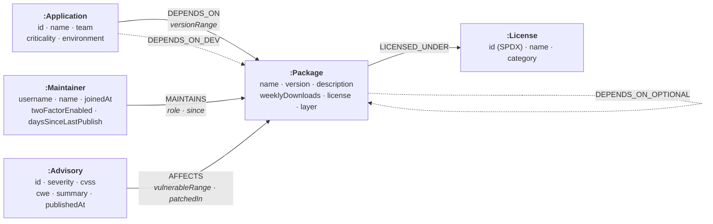

# Supply Chain Atlas

**Which of our services is actually exposed to this CVE, and how does it get in?**

A working web application that answers open-source supply-chain questions as graph traversals over
[CognoDB](https://console.cognodb.com). Built for the Wexa AI take-home assignment.

- **Live demo:** _(deployed link — see [Deploying](#deploying))_
- **Stack:** Next.js 15 (App Router) · TypeScript · Tailwind CSS v4 · `neo4j-driver` over Bolt · CognoDB

---

## The problem

A modern service declares a dozen dependencies and installs several hundred. Nobody chose most of them.
When an advisory lands against `qs` or `minimist`, three questions follow immediately, and all three are
about *connections* rather than records:

1. **Which of our services can actually reach the vulnerable package?** Not "which have it in a lockfile
   somewhere" — which ones have an unbroken chain of installed dependencies leading to it.
2. **How does it get in?** A finding that says "Checkout API is exposed" is an alert. A finding that says
   `Checkout API → express → body-parser → qs` is a ticket, because it names the thing to change.
3. **Who else can push code into that path?** Every dependency is a standing invitation for a stranger to
   run code on your servers. Which strangers, and how many services would they reach?

Supply Chain Atlas answers all three against a simulated but realistically-shaped snapshot of one
company's dependency surface — 30 services at a fictional logistics company, Meridian, sitting on 1,612
packages, 838 maintainers and 153 published advisories.

## Why a graph database?

The honest test is not "could this be done in Postgres" — it could. It is whether the natural way to ask
the question survives contact with the schema. Here, five times, it does not.

**1. The queries are about paths, and paths have no fixed length.**
The core question — "is there a chain of installed dependencies from this service to this package?" — has
no bound in the schema. Dependency trees in the seeded graph run up to seven levels deep. In SQL that is a
recursive CTE per question, written by hand, re-tuned every time the tree gets deeper. In Cypher it is
`(app)-[:DEPENDS_ON*1..5]->(pkg)` and the planner handles the expansion.

**2. The route *is* the answer, not a follow-up query.**
`shortestPath` returns the nodes it walked through. A recursive CTE returns a connected/not-connected
boolean, and reconstructing the route means either carrying an array of ancestors through every recursion
step or running a second query. Every finding in this app ships with its route because getting the route
cost nothing extra:

```cypher
MATCH (app:Application)-[:DEPENDS_ON*1..5]->(vulnerable)
WITH DISTINCT app, vulnerable
MATCH path = shortestPath((app)-[:DEPENDS_ON*1..5]->(vulnerable))
RETURN [n IN nodes(path) | n.name] AS route
```

**3. Some questions are set operations over two different traversals of the same nodes.**
"Which vulnerable packages are declared in the tree but never actually installed?" is
*everything reachable over any dependency edge*, minus *everything reachable over runtime edges alone*.
Two transitive closures and a set difference, per application. In Cypher it is one traversal and a null
check ([`getPhantomDependencies`](src/lib/queries/risk.ts)). In SQL it is two recursive CTEs and a
`NOT EXISTS`, re-evaluated per application — and the query is now long enough that nobody will change it.

**4. The interesting aggregations sit on the far side of a traversal.**
"Which single-maintainer packages hold up the most tier-1 services?" is `maintainer → package →
(transitively) → application`, aggregated at the end. The maintainer who matters is almost never the one
with the most packages; it is the one whose packages happen to sit under the most critical services, and
that is invisible until you have walked the graph. The same is true of the takeover report, which needs
the *set union* of applications across everything an account maintains.

**5. Relationship type does the filtering that a `WHERE` clause would otherwise do on every hop.**
Whether a package is really installed is a property of the *whole path* — every edge must be a runtime
dependency. Modelled as a property, that is
`WHERE all(r IN relationships(path) WHERE r.scope = 'runtime')`, which forces the path to be bound and
costs the planner its pruning optimisation. Modelled as the relationship **type**, the same question is
`-[:DEPENDS_ON*1..5]->`, and "everything declared" is a type union that is equally cheap. This is the one
modelling decision that most changed how the app performs; see [Performance](#performance-on-the-free-tier).

What a relational schema would still do better: nothing here needs multi-row transactions, and if the main
job were "sum spend by team by month" a star schema would win comfortably. The graph earns its place
because every question in this application is a reachability question.

## Data model



**2,645 nodes · 12,079 relationships**

| Label | Count | What it is |
|---|---:|---|
| `:Application` | 30 | A service Meridian runs. Tier-1 means revenue-critical. |
| `:Package` | 1,612 | An npm package **that at least one service actually pulls in**. Not a registry mirror. |
| `:Maintainer` | 838 | An account that can publish a new version of a package. |
| `:Advisory` | 153 | A published vulnerability. |
| `:License` | 12 | An SPDX licence, categorised by how much obligation it carries. |

### Two modelling decisions worth defending

**Applications and packages share the `DEPENDS_ON` relationship type.** An `:Application` is not a
`:Package`, but it depends on things the same way one does. Using the same type means a single
variable-length pattern walks from a service all the way down to a leaf utility —
`(app)-[:DEPENDS_ON*1..5]->(pkg)` — instead of needing a special case for the first hop. Every traversal in
the app is shorter because of it.

**Dependency scope is a relationship type, not a property.** `DEPENDS_ON` is installed at runtime;
`DEPENDS_ON_OPTIONAL` and `DEPENDS_ON_DEV` are declared but may never reach the running artifact. This
mirrors how npm actually behaves — a transitive dev dependency is not installed at all — and it is what
lets both the strict and the loose question be fast. The scope is kept as a property too, because it is
worth displaying.

`DEPENDS_ON` is acyclic by construction: the generator assigns every package a layer and only ever draws
edges to a strictly lower one, so variable-length traversals always terminate.

## The queries

All of them live in [`src/lib/queries/`](src/lib/queries/), one module per area. Nothing else in the
codebase talks to the driver.

| Query | What it answers | Why it's interesting |
|---|---|---|
| [`getBlastRadius`](src/lib/queries/advisories.ts) | Given one advisory, which services are exposed and by what route | **Multi-hop + `shortestPath`.** Runs the traversal twice over different relationship types to separate "ships in production" from "declared but not installed" |
| [`getPhantomDependencies`](src/lib/queries/risk.ts) | Vulnerable packages that are in the tree but never installed | **Set difference between two transitive closures.** The one that is genuinely painful anywhere else |
| [`getChokepoints`](src/lib/queries/risk.ts) | Packages reaching many services, controlled by one account | Traverse, then aggregate, then filter — in that order, for cost reasons |
| [`getTakeoverRisk`](src/lib/queries/risk.ts) | If this account were compromised, what would we rebuild? | Two-hop with a **set union** of applications across everything the account maintains |
| [`getLicenseExposure`](src/lib/queries/risk.ts) | Copyleft reachable over installed dependencies only | The obligation is a property of the *path*, not of either endpoint |
| [`findRoutes`](src/lib/queries/paths.ts) | Why is this package in my build? | `allShortestPaths` — *every* shortest route, because "three different dependencies pull it in" is the real answer |
| [`getApplicationExposure`](src/lib/queries/overview.ts) | Per-service exposure for the dashboard | Three pruned traversals, aggregated without a cross-product |

### The flagship, annotated

```cypher
MATCH (:Advisory { id: $advisoryId })-[:AFFECTS]->(vulnerable:Package)
MATCH (app:Application)

// Two traversals over the same endpoints, differing only in edge type.
// The first is what actually ships; the second also follows optional and dev
// dependencies, which are declared but may never be installed.
OPTIONAL MATCH installed = shortestPath((app)-[:DEPENDS_ON*1..5]->(vulnerable))
OPTIONAL MATCH declared  = shortestPath(
  (app)-[:DEPENDS_ON|DEPENDS_ON_OPTIONAL|DEPENDS_ON_DEV*1..5]->(vulnerable))

WITH app,
     CASE WHEN length(installed) <= $maxDepth THEN installed END AS installed,
     CASE WHEN length(declared)  <= $maxDepth THEN declared  END AS declared
WHERE installed IS NOT NULL OR declared IS NOT NULL

RETURN app.name,
       length(installed) AS installedHops,
       installed IS NULL AS declaredOnly,   // reachable, but not shipped
       [n IN nodes(coalesce(installed, declared)) | n.name] AS route
ORDER BY declaredOnly, app.criticality, installedHops
```

Two things are worth pointing out. `installed IS NULL` is the entire phantom-dependency distinction in
four characters — the difference between paging someone at 3am and filing a ticket. And `$maxDepth` is a
real parameter: because the path is *bound*, its length can be measured and filtered, which is how the
UI's hop-count control works.

### Why the depth limit is a constant

Cypher will not accept a parameter as a variable-length bound — `[:DEPENDS_ON*1..$depth]` is a syntax
error, because the bounds are part of the plan rather than the input. Building the number into the query
string would mean concatenating Cypher, which this codebase does not do anywhere. So the bound is a
constant of the application (five hops), and queries that bind the path filter on `length(path)`, which is
a genuine parameter. In the seeded graph, 99%+ of application-to-package routes are within five hops.

### Parameterisation

Every query is a **constant string** with `$name` placeholders. Values travel separately in the Bolt
message, which makes Cypher injection impossible and lets the server cache one plan per query. Optional
filters are expressed *inside* the query rather than by assembling a different one:

```cypher
WHERE (size($severities) = 0 OR adv.severity IN $severities)
  AND ($search = '' OR toLower(pkg.name) CONTAINS toLower($search))
```

One place composes a **constant fragment** — a shared `RETURN` projection in
[`paths.ts`](src/lib/queries/paths.ts) — across three queries. It contains no values and does not vary with
input; every value still travels as a parameter.

## Setting up

### 1. Create a CognoDB instance

1. Sign up at [console.cognodb.com/signup](https://console.cognodb.com/signup) — the free tier needs no
   card.
2. Create a free **c0** instance and pick a region. It provisions in under a minute.
3. Copy the connection URI (`bolt+s://<instance-id>.databases.cognodb.cloud`) and the generated password.
   **The password is shown exactly once** — save it before leaving the page. If you lose it, rotate it from
   the console rather than guessing.

### 2. Configure and seed

```bash
git clone <this-repo> && cd cognodb-supply-chain
npm install
cp .env.example .env.local     # then fill in COGNODB_URI and COGNODB_PASSWORD
npm run seed
```

`.env.local` is git-ignored. The password is never committed and never reaches the browser — the driver
sits behind a `server-only` import, so a client component that tried to reach it would fail at build time
rather than leaking a secret into a bundle.

Seeding takes about a minute against a free instance. It creates constraints and indexes, then loads the
graph in batched `UNWIND $rows` statements — a few hundred round trips instead of tens of thousands, which
matters on a burstable 0.5 vCPU instance.

```bash
npm run seed          # skips if data is already there
npm run seed:reset    # wipe and reload
```

### 3. Run it

```bash
npm run dev           # http://localhost:3000
```

### Other commands

```bash
npm run verify           # run every query against the live instance, with timings
npm run inspect:dataset  # check the generated data's properties — no database needed
npm run typecheck
npm run lint
npm run build
```

`npm run verify` is the closest thing here to a test suite: it exercises all 21 queries, asserts that each
returns something usable (an empty chokepoint report is a bug, not a clean bill of health), and prints how
long each took.

## Project structure

```
src/
  lib/
    env.ts            Reads and validates connection details. Throws loudly rather
                      than defaulting to localhost.
    neo4j.ts          The driver: one pooled instance, cached across hot reloads,
                      server-only. runQuery() is the single door to the database.
    errors.ts         Maps driver failures onto six kinds the UI can render
                      differently — unreachable, unauthorized, timeout, …
    attempt.ts        Turns a query failure into a value, so one panel can fail
                      without taking the page down with it.
    queries/          Every Cypher query, one module per area of the graph.
  components/
    graph-canvas.tsx  d3-force layout in SVG. Dependents settle left, dependencies
                      right, so the picture reads the way the sentence does.
    route-trail.tsx   A dependency path rendered as a chain — the component that
                      makes the graph legible to someone who doesn't think in graphs.
    filters.tsx       URL-backed filters, so any filtered view is a shareable link.
  app/                Pages. Server components query directly; client components
                      handle interaction only.
scripts/
  dataset.ts          Deterministic dataset generator.
  seed.ts             Batched, parameterised loader.
  verify.ts           Runs every query against the live instance.
  inspect-dataset.ts  Asserts the dataset's structural properties.
```

### Layering

Server components call query functions; query functions call `runQuery`; `runQuery` owns the driver.
Nothing else imports `neo4j-driver`. Cypher lives in exactly one directory, error handling happens in
exactly one place, and swapping the transport would touch one file.

## Engineering notes

### When the database is unreachable

The single most likely thing to go wrong with a free-tier demo is the instance going to sleep, so this is
handled as a first-class state rather than as an exception:

- **A connection indicator in the sidebar** polls `/api/health`, so "is it me or the database?" is
  answerable at a glance rather than by waiting for a page to fail.
- **Failures are values, not exceptions.** `attempt()` catches per panel, so a sleeping instance shows a
  retry card in the affected panel while the rest of the page keeps working. Blowing away the whole page
  makes the app feel broken when the fix is to wait ten seconds.
- **Different failures get different screens.** A missing environment variable gets a setup checklist; a
  rejected password gets told the credential is shown only once and needs rotating; a paused instance gets
  a retry button. One generic "Error" box would make the reader diagnose it themselves.
- **Retry is `router.refresh()`**, which re-runs only the server components for the current route and keeps
  scroll position and filters intact.
- **Raw driver messages never reach the browser** except through a deliberate, safe `detail` field.

Worth trying: stop the instance from the CognoDB console, or corrupt `COGNODB_PASSWORD`, and reload.

### Performance on the free tier

A c0 instance is 0.5 burstable vCPU and 256 MB. Three things keep the pages fast:

1. **Relationship types instead of path predicates.** `all(r IN relationships(path) WHERE …)` forces the
   path to be bound, which costs the planner its pruning expansion — a five-hop traversal then enumerates
   hundreds of thousands of *paths* instead of visiting each node once. Encoding scope in the type keeps
   the common traversals prunable.
2. **Traverse once, then join.** The chokepoint report expands out from the 30 applications a single time
   to get every package's reach, then filters by maintainer count. Written the other way round — find
   single-maintainer packages first, then traverse from each — it would run one traversal per package.
3. **Several small queries rather than one wide one.** The package page fans out to dependencies,
   dependents, maintainers, advisories and applications; asking for all of that in one query multiplies
   cardinality through the joins and turns one page load into a million rows.

`npm run verify` prints per-query timings and flags anything over three seconds.

### Interface decisions

- **Filters live in the URL.** A filtered view is a link that can be pasted into an incident channel, and
  it survives a refresh and the back button.
- **Colour is only ever severity.** The palette is otherwise a near-black canvas and one cyan accent, so
  when something is red it is red because it matters.
- **Every finding shows its route.** A table that says "exposed" invites the question "through what?" — and
  the traversal already returned the answer.
- **Loading states are skeletons of the actual layout**, streamed per panel via `<Suspense>`, so the page
  does not reflow when data lands.
- **Empty states distinguish "nothing found" from "nothing matches your filter"** and say which.

## About the data

The dataset is **a realistic simulation, not a live feed** — this is a demo application, not a
vulnerability database, and nothing here should be used to decide whether a real deployment is affected.

- **~170 core packages are real**, with their real dependency edges: `express` really does depend on
  `body-parser`, `qs`, `send` and the rest. That structure is what makes the demo legible.
- **~1,440 long-tail packages are generated**, layered underneath with sub-linear preferential attachment
  so that dependent counts and download figures follow the power law the real registry does.
- **26 advisories are modelled on real published GHSA/CVE records** (`CVE-2021-44906` against `minimist`,
  and so on). The other 127 are simulated, clearly marked with a `GHSA-SIM-` prefix and a "simulated" badge
  in the UI.
- **Maintainers, applications and the company are entirely fictional.**

Two properties of the generator are deliberate rather than incidental, and the app would be dishonest
without them:

**Maintainer count is not correlated with popularity.** It would be tidier to give popular packages more
maintainers, but the packages behind real supply-chain incidents — `event-stream`, `ua-parser-js`,
`node-ipc` — were downloaded millions of times a week and looked after by one person. Correlating the two
would mean the single-maintainer report only ever surfaced obscure leaves, and the feature would be a lie.

**Only packages that some service actually pulls in are stored.** The generator builds a larger registry
and then prunes to the reachable subgraph, so the database is an SBOM rather than a registry mirror. No
query can return a result that is technically true but operationally meaningless.

Everything is driven by a fixed seed, so `npm run seed` produces identical data on every machine — which is
why the numbers in this README match what you will see.

## Deploying

The app is a standard Next.js application with no build-time database access, so any Node host works.

```bash
npm i -g vercel
vercel                             # link the project
vercel env add COGNODB_URI
vercel env add COGNODB_PASSWORD
vercel env add COGNODB_USERNAME    # cognodb
vercel --prod
```

The CognoDB instance must be running and seeded for the deployment to show anything; if it is not, the app
renders its "unreachable" state rather than crashing.

## Screenshots

_(added after deployment)_

---

Built by **Rahul Kumar** for the Wexa AI CognoDB assignment. Every design decision above is one I am happy
to defend line by line — including the ones I would make differently at ten times the data volume.
